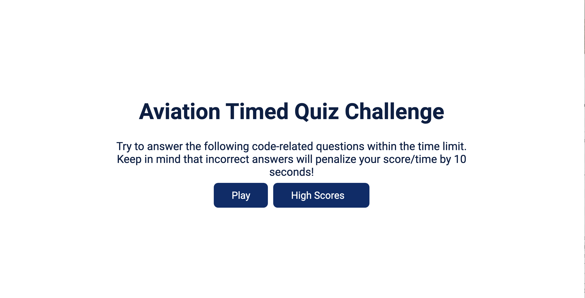

# code-quiz

Create a timed quiz using JavaScript that stores high scores and gauge progress compared to peers:

	Functionality Requirements:
•	click the start button
  -	timer starts and I am presented with a question
•	When question is answered
  -	Present user with another question
•	When question is answered incorrectly
  -	time is subtracted from the clock
•	When all questions are answered, or the timer reaches 0
  -	the game is over
•	When the game is over
  -	User can save initials and score

Construction Steps:
 
• created html framework for each page the user will be directed to.

• created questions page that allows the user select an answer to a question and then navigate to next question.

• created a countdown clock that starts when a users start the quiz and time is subtracted on incorrect answers.

• created JS functions that when time expires, then redirects user to a final score page to enter name and see final score.

• created a High Scores (leaderboard) page for a user to see thier score ranking.

